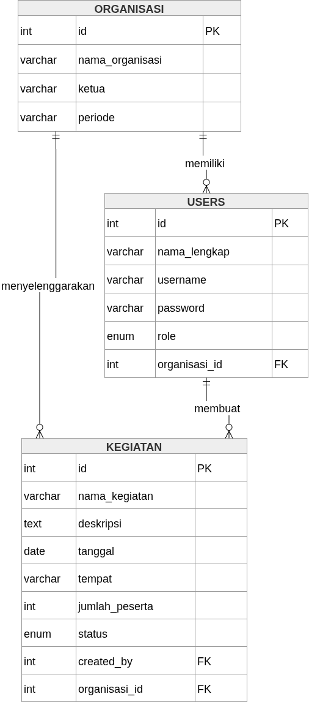
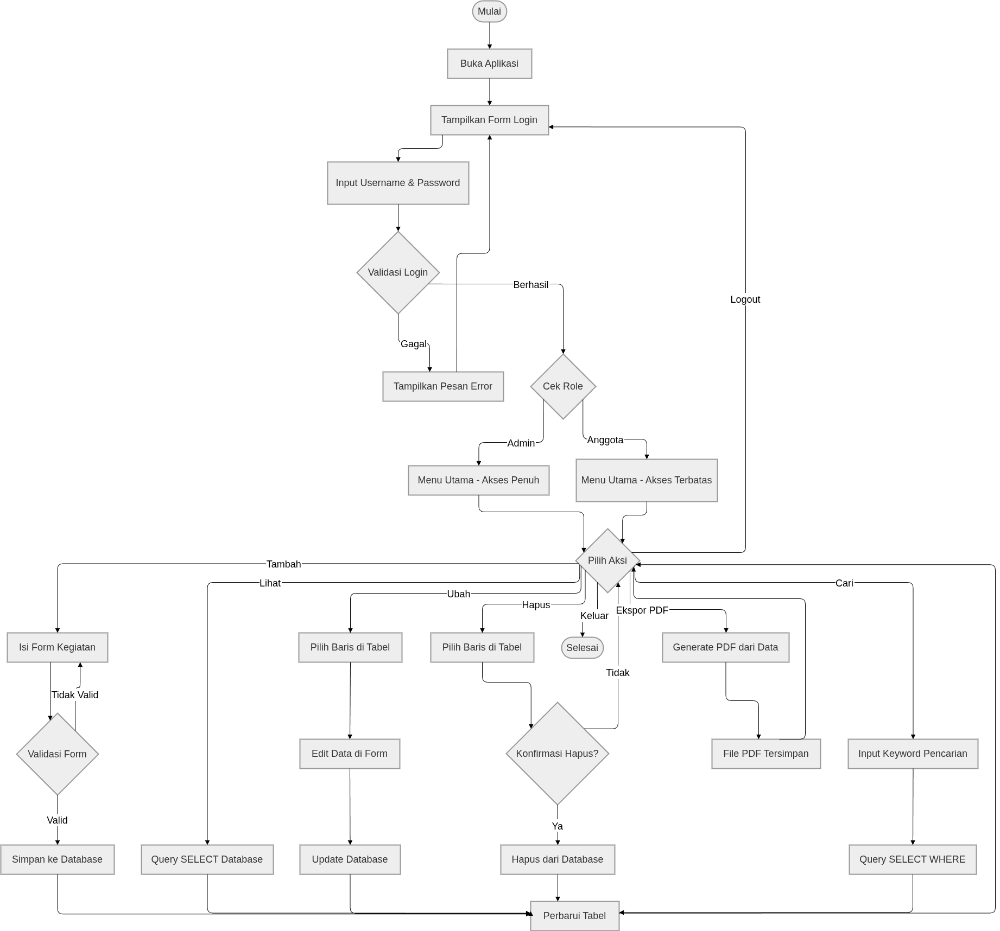

# Laporan Proyek SIMPOKA — Sistem Informasi Pengawasan Kegiatan

---

## 1. Latar Belakang

Organisasi kemahasiswaan seperti UKM, HMJ, dan BEM memiliki banyak kegiatan yang perlu dipantau dan dilaporkan secara berkala. Selama ini pencatatan kegiatan masih dilakukan secara manual (buku catatan atau spreadsheet) sehingga rawan kehilangan data, sulit dicari kembali, dan tidak memiliki format laporan yang baku. Oleh karena itu, dibutuhkan sebuah sistem berbasis desktop yang dapat membantu mencatat, memantau, dan melaporkan kegiatan organisasi secara terstruktur.

---

## 2. Tujuan

- Membangun aplikasi desktop untuk mengelola data kegiatan organisasi secara digital
- Menyediakan fitur CRUD (Create, Read, Update, Delete) kegiatan
- Memudahkan pencarian kegiatan berdasarkan kata kunci
- Menghasilkan laporan PDF yang rapi dan siap cetak
- Menerapkan kontrol akses berbasis peran (admin_utama, admin, member)

---

## 3. Batasan Masalah

- Aplikasi berbasis desktop (Java Swing), bukan web atau mobile
- Database menggunakan MySQL/MariaDB lokal
- Tidak ada fitur notifikasi real-time
- Tidak ada integrasi API eksternal
- Laporan hanya dalam format PDF (tidak ada format Excel/CSV)
- Aplikasi berjalan dalam satu jaringan lokal (single-user mode per instance)

---

## 4. Metode

Pengembangan sistem menggunakan model **Waterfall** yang terdiri dari 7 tahap:

| Minggu | Tahap | Kegiatan |
|--------|-------|----------|
| 1 | Setup & Database | Instalasi tools, perancangan ERD, pembuatan database dan tabel |
| 2 | Create | Pembuatan form input dan penyimpanan data kegiatan |
| 3 | Read | Menampilkan data kegiatan dalam JTable |
| 4 | Update & Delete | Fitur edit dan hapus kegiatan dengan konfirmasi |
| 5 | Pencarian & PDF | Fitur search dan ekspor laporan ke PDF |
| 6 | Testing & Debug | Pengujian seluruh skenario dan perbaikan bug |
| 7 | Finishing | Perapian UI, data dummy, persiapan presentasi |

---

## 5. Tech Stack

| Komponen | Teknologi |
|----------|-----------|
| Bahasa Pemrograman | Java 11+ |
| GUI Framework | Java Swing (JFrame, JPanel, JTable) |
| Database | MySQL 5.7+ / MariaDB 10.3+ |
| Koneksi Database | JDBC dengan mysql-connector-j 9.7.0 |
| Laporan PDF | pdfa 7.1.3 |
| Tools Pengembangan | VS Code + Java Extension Pack, XAMPP |
| Version Control | Git + GitHub |

---

## 6. Hasil

- **Aplikasi desktop** berhasil dibangun dengan 3 halaman utama: Login, Dashboard, dan Form Kegiatan
- **CRUD lengkap**: Tambah, lihat, ubah, dan hapus kegiatan berjalan dengan baik
- **Pencarian**: Filter kegiatan berdasarkan kata kunci nama kegiatan
- **Export PDF**: Laporan PDF dengan header organisasi, tabel kegiatan, dan footer tanggal cetak
- **Role-based access**: Tiga level akses — admin_utama (full), admin (kelola kegiatan), member (lihat saja)
- **Ubah Status Cepat**: Menu 3-dot untuk mengganti status kegiatan tanpa membuka form edit
- **3 organisasi** dan **6 user** siap pakai dengan data dummy
- **Database**: 3 tabel (organizations, users, activities) dengan relasi foreign key dan indexing

### Entity Relationship Diagram

### Flowchart Aplikasi

---

## 7. Kesimpulan

SIMPOKA berhasil dikembangkan sebagai aplikasi monitoring kegiatan organisasi berbasis Java Swing. Seluruh fitur CRUD, pencarian, ekspor PDF, dan kontrol akses berjalan sesuai kebutuhan. Aplikasi siap digunakan oleh organisasi kemahasiswaan untuk mencatat dan melaporkan kegiatan secara digital.

---

## 8. Saran

- Tambahkan fitur **notifikasi** untuk kegiatan yang mendekati tanggal pelaksanaan
- Kembangkan versi **web** atau **mobile** agar bisa diakses dari mana saja
- Gunakan **hashing password** (bcrypt/argon2) untuk keamanan autentikasi
- Tambahkan **filter berdasarkan status** (planned/ongoing/completed) di samping pencarian teks
- Dukungan **multi-bahasa** (Indonesia/Inggris) untuk antarmuka
- Integrasi dengan **kalender** (iCalendar/Google Calendar) untuk sinkronisasi jadwal kegiatan
